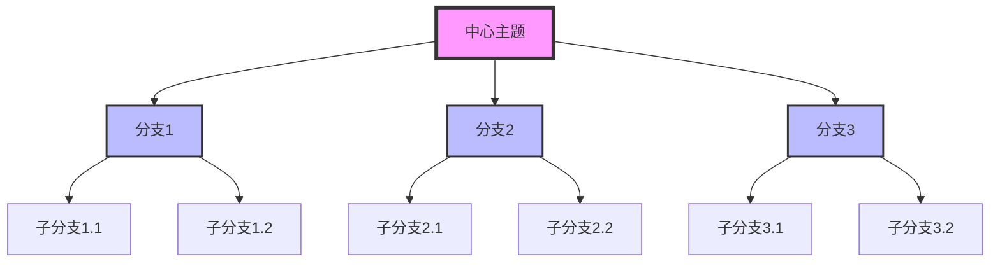
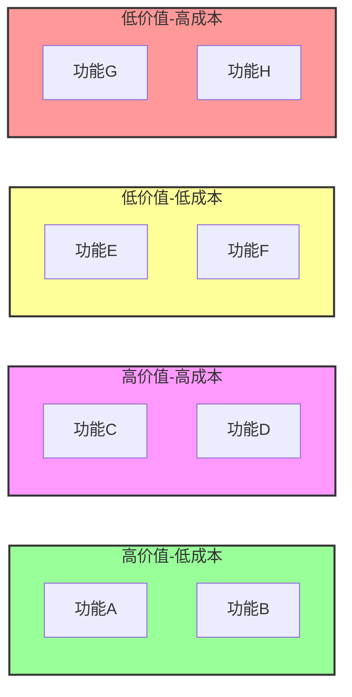

# Mermaid 图表显示问题解决方案

## 问题：mindmap 和 quadrantChart 不显示

### 原因分析

1. **插件版本兼容性**
   - `mindmap` 和 `quadrantChart` 是较新添加的Mermaid图表类型
   - 某些插件版本可能不支持这些新图表类型
   - VS Code的Markdown预览可能使用较旧的Mermaid渲染引擎

2. **已安装的插件**
   - `bierner.markdown-mermaid v1.29.0` - 基础Mermaid支持
   - `vstirbu.vscode-mermaid-preview v2.1.2` - 替代预览插件（已安装）

### 解决方案

#### 方案1：使用替代预览插件

1. 安装了 `vstirbu.vscode-mermaid-preview` 插件
2. 使用方法：
   - 打开包含Mermaid图表的Markdown文件
   - 按 `Ctrl+Shift+P` 打开命令面板
   - 输入 "Mermaid: Open Preview" 并选择
   - 这将打开一个独立的Mermaid预览窗口

#### 方案2：使用在线Mermaid编辑器

1. 访问 [Mermaid Live Editor](https://mermaid.live/)
2. 在线编辑和预览图表
3. 导出为图片并嵌入到Markdown中

#### 方案3：使用替代图表语法

##### Mindmap 替代方案

使用流程图模拟思维导图：


##### QuadrantChart 替代方案

使用带样式的流程图模拟象限图：


#### 方案4：使用其他图表库

考虑使用PlantUML或其他支持更多图表类型的工具：
- PlantUML思维导图：`@startmindmap ... @endmindmap`
- Graphviz DOT语言：更灵活的图形描述

### 测试文件

我已创建了以下测试文件供您参考：

1. `mermaid高级测试.md` - 包含各种图表类型和替代方案
2. `mermaid测试.md` - 基础图表测试

### 推荐工作流程

1. 对于基础图表（流程图、时序图、类图等），使用内置的Markdown预览
2. 对于高级图表（mindmap、quadrantChart等），使用 `vstirbu.vscode-mermaid-preview` 插件
3. 如果仍不显示，使用替代语法或在线编辑器

### 长期解决方案

1. 关注Mermaid和插件的更新
2. 考虑使用支持更多图表类型的替代工具
3. 为团队制定统一的图表规范和工具链

### 其他提示

- 某些图表类型可能需要特定的Mermaid版本
- 插件更新可能需要重启VS Code
- 可以尝试在VS Code设置中指定Mermaid版本

```json
{
  "markdown.mermaid.enable": true,
  "markdown.mermaid.theme": "default",
  "markdown.mermaid.codeBlockTheme": "default"
}
```