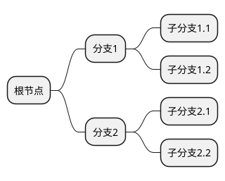
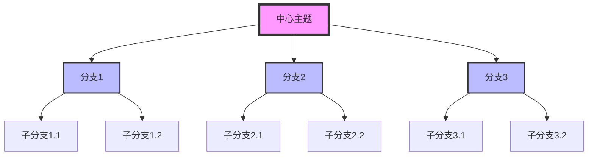
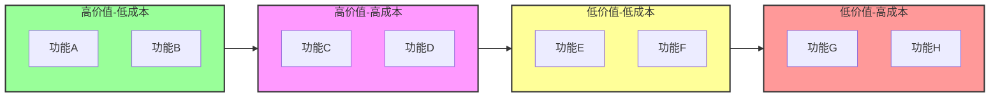

# Mermaid 高级图表解决方案

## 问题：mindmap 和 quadrantChart 仍然不显示

经过尝试，我们发现某些Mermaid图表类型（如mindmap和quadrantChart）在VS Code的Markdown预览中可能无法正确显示。以下是几种可行的解决方案：

## 解决方案1：使用在线Mermaid编辑器

### 步骤
1. 访问 [Mermaid Live Editor](https://mermaid.live/)
2. 将您的Mermaid代码粘贴到编辑器中
3. 点击"Actions" > "Download SVG"或"Download PNG"
4. 将下载的图片保存到项目中
5. 在Markdown中引用图片

### 示例
```markdown
# 我的思维导图


```

## 解决方案2：使用PlantUML作为替代

### 安装PlantUML插件
```bash
code --install-extension jebbs.plantuml
```

### 思维导图示例


## 解决方案3：使用HTML嵌入Mermaid

创建一个HTML文件，然后在Markdown中引用：

### 创建HTML文件 (mindmap.html)
```html
<!DOCTYPE html>
<html>
<head>
    <title>Mindmap</title>
    <script src="https://cdn.jsdelivr.net/npm/mermaid/dist/mermaid.min.js"></script>
</head>
<body>
    <div class="mermaid">
        mindmap
          root((思维导图))
            分支1
              子分支1.1
              子分支1.2
            分支2
              子分支2.1
              子分支2.2
    </div>
    <script>
        mermaid.initialize({ startOnLoad: true });
    </script>
</body>
</html>
```

### 在Markdown中引用
```markdown
<iframe src="./mindmap.html" width="800" height="600"></iframe>
```

## 解决方案4：使用图片生成服务

### Mermaid CLI
```bash
npm install -g @mermaid-js/mermaid-cli
mmdc -i input.mmd -o output.png
```

### 在线服务
- [Mermaid.ink](https://mermaid.ink/) - 直接生成图片链接
- [Kroki](https://kroki.io/) - 支持多种图表格式

## 解决方案5：使用替代图表语法

### 思维导图替代方案


### 象限图替代方案


## 推荐工作流程

1. **对于基础图表**：继续使用VS Code内置的Markdown预览
2. **对于高级图表**：
   - 使用在线Mermaid编辑器生成图片
   - 或者使用PlantUML作为替代
   - 或者使用替代语法

## 项目图片目录

建议创建一个专门的图片目录来存储生成的图表：
```
RedBookCards-1.0.2/
├── images/
│   ├── diagrams/
│   │   ├── mindmap.png
│   │   ├── quadrant.png
│   │   └── ...
```

## 自动化脚本

您可以创建一个简单的脚本来自动生成Mermaid图片：

```bash
#!/bin/bash
# 生成所有Mermaid图表的脚本

for file in diagrams/*.mmd; do
    echo "Processing $file..."
    mmdc -i "$file" -o "images/${file%.mmd}.png"
done
```

这样，即使某些高级图表类型在VS Code中无法直接显示，您仍然可以在文档中包含它们。