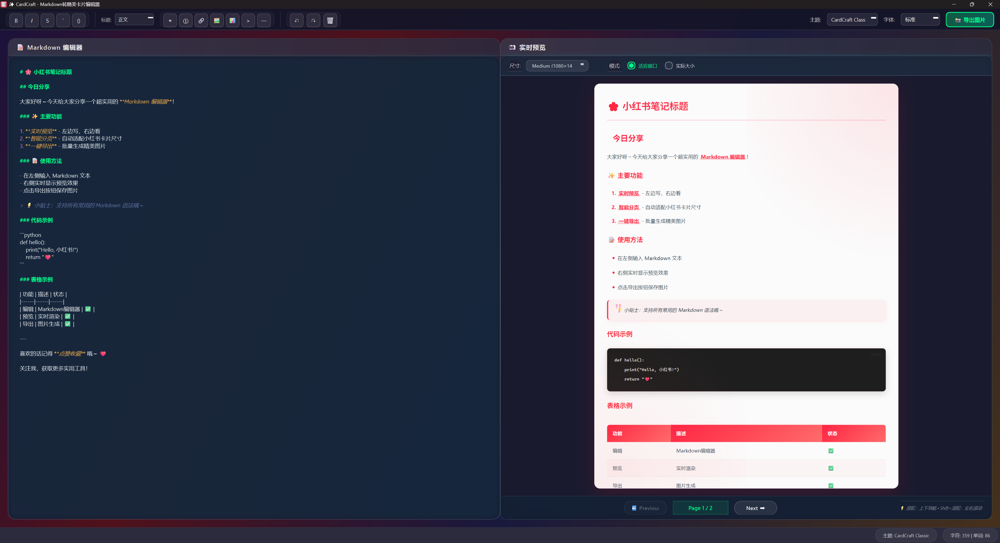

# CardCraft - Markdown转精美卡片编辑器

<div align="center">
  

# ✨ CardCraft

  **将 Markdown 转换为精美卡片**

  [](https://www.python.org/)
  [](https://www.riverbankcomputing.com/software/pyqt/)
  [](LICENSE)
  [](https://github.com/wonderez/RedBookCards/releases)

  [🎯 下载](https://github.com/wonderez/CardCraft/releases) •
  [📚 文档](https://github.com/wonderez/CardCraft/wiki) •
  [🐛 问题反馈](https://github.com/wonderez/CardCraft/issues) •
  [⭐ Star](https://github.com/wonderez/CardCraft)

</div>

---

## 📸 效果展示

<div align="center">
  

  *一键将 Markdown 转换为精美卡片*

</div>

---

## 🌟 核心特性

### 🎯 智能分页系统

- **精准分页算法**：基于内容高度的智能计算，确保每页 1080×1440px 的完美布局
- **内容完整性保护**：
  - 段落不会在中间断开
  - 标题与后续内容保持同页（HEADING_KEEP_WITH = 150px）
  - 列表项智能分组，避免孤立项
  - 代码块完整性保护
- **支持手动分页**：使用 `<!-- pagebreak -->` 标记强制分页
- **三种页面尺寸**：
  - 📱 Small (720×960) - 适合手机分享
  - 📖 Medium (1080×1440) - 标准小红书尺寸
  - 🖼️ Large (1440×1920) - 高清大图

### 🎨 12种精选主题

- **社交媒体风格**：CardCraft Classic、Instagram渐变、微信简约、抖音酷黑
- **知识平台风格**：知乎蓝、Notion极简
- **优雅配色**：优雅紫、海洋蓝、日落橙、森林绿
- **深色主题**：深色模式、午夜紫

### 🔤 灵活字体选择

- **系统字体支持**：自动检测并加载系统中所有可用字体
- **常用字体快捷选择**：提供常用字体（如微软雅黑、思源黑体、Arial等）的快速选择
- **字体记忆功能**：自动保存用户上次选择的字体，下次启动时自动恢复
- **实时字体预览**：选择字体后立即在预览区域显示效果
- **跨平台兼容**：支持Windows、macOS和Linux系统的字体

### ⚡ 实时预览体验

- **双模式预览**：
  - 🔍 适应窗口：自动缩放以适应窗口大小
  - 📏 实际大小：1:1 显示实际导出效果
- **低延迟响应**：300ms 防抖动更新
- **便捷操作**：
  - 滚轮翻页：适应模式下滚轮切换页面
  - Shift+滚轮：实际大小模式下横向滚动

### 📸 高质量导出

- **批量导出**：一键导出所有分页为独立图片
- **格式支持**：PNG (无损) / JPEG (可调质量)
- **进度追踪**：实时显示导出进度
- **智能命名**：card_01.png, card_02.png...

---

## 🚀 快速开始

### 安装运行

#### 方式一：下载可执行文件（推荐）

1. 前往 [Releases](https://github.com/wonderez/CardCraft/releases) 页面
2. 下载最新版本的 `CardCraft.exe`
3. 双击运行即可使用

#### 方式二：源码运行

```bash
# 克隆项目
git clone https://github.com/wonderez/CardCraft.git
cd CardCraft

# 安装依赖
pip install -r requirements.txt

# 运行程序
python main.py
```

#### 方式三：打包为可执行文件

```bash
# 运行打包脚本
python build.py

# 或指定参数
python build.py --mode onefile --shortcut
```

---

## 📖 使用指南

### 基础操作流程

1. **✍️ 编写内容**：在左侧编辑器输入 Markdown 文本
2. **👀 实时预览**：右侧自动显示渲染效果
3. **🎨 切换主题**：工具栏选择不同的视觉主题
4. **🔤 选择字体**：工具栏字体选择器选择合适的字体
5. **📐 调整尺寸**：选择 Small/Medium/Large 三种尺寸
6. **💾 导出图片**：点击"导出图片"按钮，选择保存位置

### Markdown 语法支持

| 语法类型 | 支持情况            | 示例                             |
| -------- | ------------------- | -------------------------------- |
| 标题     | ✅ H1-H6            | `# 一级标题`                   |
| 文本样式 | ✅ 粗体/斜体/删除线 | `**粗体** *斜体* ~~删除线~~`   |
| 列表     | ✅ 有序/无序        | `- 项目` `1. 项目`           |
| 任务列表 | ✅ GitHub风格       | `- [ ] 待办` `- [x] 完成`    |
| 引用     | ✅ 多级引用         | `> 引用内容`                   |
| 代码     | ✅ 行内/代码块      | `` `code` ``                     |
| 表格     | ✅ 对齐控制         | `                                |
| 链接图片 | ✅ 完整支持         | `[文本](url)` `` |
| 分隔线   | ✅                  | `---`                          |
| Emoji    | ✅                  | 😊 🎉 ⭐                         |

### 分页控制技巧

```markdown
# 第一页内容
这是第一页的内容，会自动根据高度分页...

<!-- pagebreak -->

# 第二页内容  
手动插入分页符，强制开始新的一页...
```

---

## 🏗️ 技术架构

### 核心技术栈

- **GUI框架**: PyQt6 (Qt 6.5+)
- **渲染引擎**: QWebEngineView (Chromium内核)
- **Markdown解析**: python-markdown + 自定义扩展
- **样式系统**: CSS3 + 动态主题引擎
- **分页算法**: 基于元素高度的智能计算

### 关键模块解析

#### 🧩 智能分页器 (`paginator.py`)

```python
# 核心算法：基于内容高度的动态分页
- 解析HTML为元素列表
- 计算每个元素的渲染高度
- 应用分页策略（标题关联、段落完整等）
- 优化页面填充率（避免过空）
```

#### 🎨 样式管理器 (`style_manager.py`)

```python
# 主题系统：12种预设主题
- 动态CSS生成
- 颜色工具函数（lighten/darken/alpha）
- 响应式字体大小
- 深浅色模式自适应
- 字体设置存储与恢复
```

#### 🔤 字体选择器 (`main_window.py`)

```python
# 字体系统：跨平台字体支持
- QFontDatabase系统字体检测
- 字体选择器UI组件
- 字体变化信号处理
- 字体设置持久化存储
```

#### 📄 HTML生成器 (`html_generator.py`)

```python
# 页面生成：完整的HTML文档
- 主题CSS注入
- 页面布局控制
- 装饰元素（渐变、阴影）
- 页码信息显示
```

---

## 📊 性能指标

| 指标         | 目标值   | 实际值         | 状态    |
| ------------ | -------- | -------------- | ------- |
| 实时预览延迟 | < 300ms  | 300ms (防抖动) | ✅ 达标 |
| 文档容量     | 10,000字 | 支持           | ✅ 达标 |
| 导出速度     | < 1s/页  | ~500ms/页      | ✅ 优秀 |
| 内存占用     | < 200MB  | ~150MB         | ✅ 优秀 |

---

## 🎯 核心创新点

### 1. 🔄 扁平化HTML解析

将嵌套的HTML结构扁平化为线性元素列表，便于分页计算：

```python
def _flatten_parse(self, node) -> List[PageElement]:
    # 深度优先遍历，确保分页标记被正确识别
    # 支持段落内的分页标记检测
```

### 2. 🖼️ 双模式预览系统

- **适应窗口模式**：使用CSS transform实现无损缩放
- **实际大小模式**：禁用WebView内部滚动，由Qt ScrollArea接管

### 3. ⏱️ 防抖动更新机制

```python
self.update_timer = QTimer()
self.update_timer.timeout.connect(self.update_preview)
self.update_timer.setInterval(300)  # 300ms延迟
```

### 4. ✅ 任务列表扩展

自定义Markdown扩展，完美支持GitHub风格的任务列表：

```python
class TaskListExtension(markdown.Extension):
    # 优先级100，在列表处理前执行
    # 支持 - [ ] 和 - [x] 语法
```

### 5. 🔤 跨平台字体系统

```python
def _setup_font_selector(self):
    # 使用QFontDatabase检测系统字体
    # 常用字体优先显示，提升用户体验
    # 字体设置持久化，下次启动自动恢复
    # 实时字体预览，所见即所得
```

---

## 🛠️ 开发路线图

### 近期计划

- [ ] 🍎 macOS/Linux 平台支持
- [ ] 🎨 自定义主题编辑器
- [ ] 📚 Markdown 模板库
- [ ] ☁️ 云端同步功能

### 长期规划

- [ ] 🚀 批量处理模式
- [ ] 🔌 插件系统
- [ ] 🤖 AI 内容优化
- [ ] 📱 移动端适配

---

## 🤝 贡献指南

欢迎提交 Issue 和 Pull Request！

1. Fork 本项目
2. 创建你的特性分支 (`git checkout -b feature/AmazingFeature`)
3. 提交你的改动 (`git commit -m 'Add some AmazingFeature'`)
4. 推送到分支 (`git push origin feature/AmazingFeature`)
5. 开启一个 Pull Request

---

## 👏 致谢

- [PySide6](https://doc.qt.io/qtforpython/) - 强大的GUI框架
- [python-markdown](https://python-markdown.github.io/) - 优秀的Markdown解析器
- [小红书](https://www.xiaohongshu.com/) - 设计灵感来源
- [Claude](https://claude.ai/) - AI开发助手
- [RedBookCards](https://github.com/pilipala5/RedBookCards) - 本项目的原始代码来源

---

## 📄 开源协议

本项目采用 MIT 协议开源 - 查看 [LICENSE](LICENSE) 文件了解更多细节

---

## 📞 联系方式

- 🐙 GitHub: [@wonderez](https://github.com/wonderez)

---

<div align="center">

### 🌟 如果这个项目对你有帮助，请给一个 Star！

[](https://star-history.com/#wonderez/CardCraft&Date)

  Copyright © 2025 CardCraft. All rights reserved.

</div>
