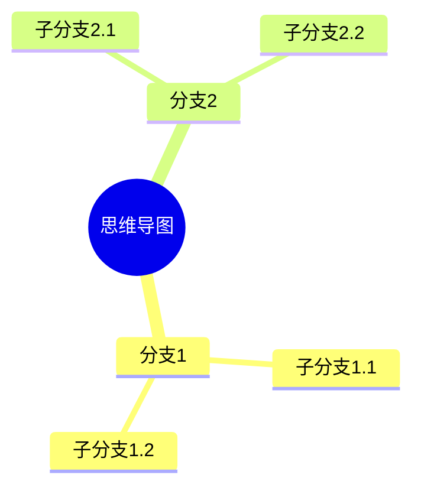
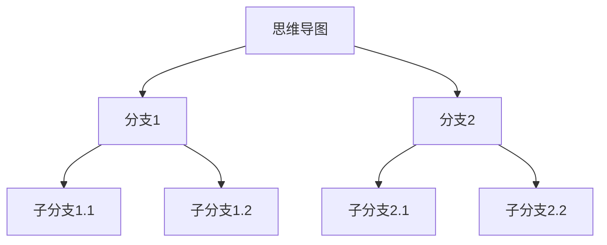
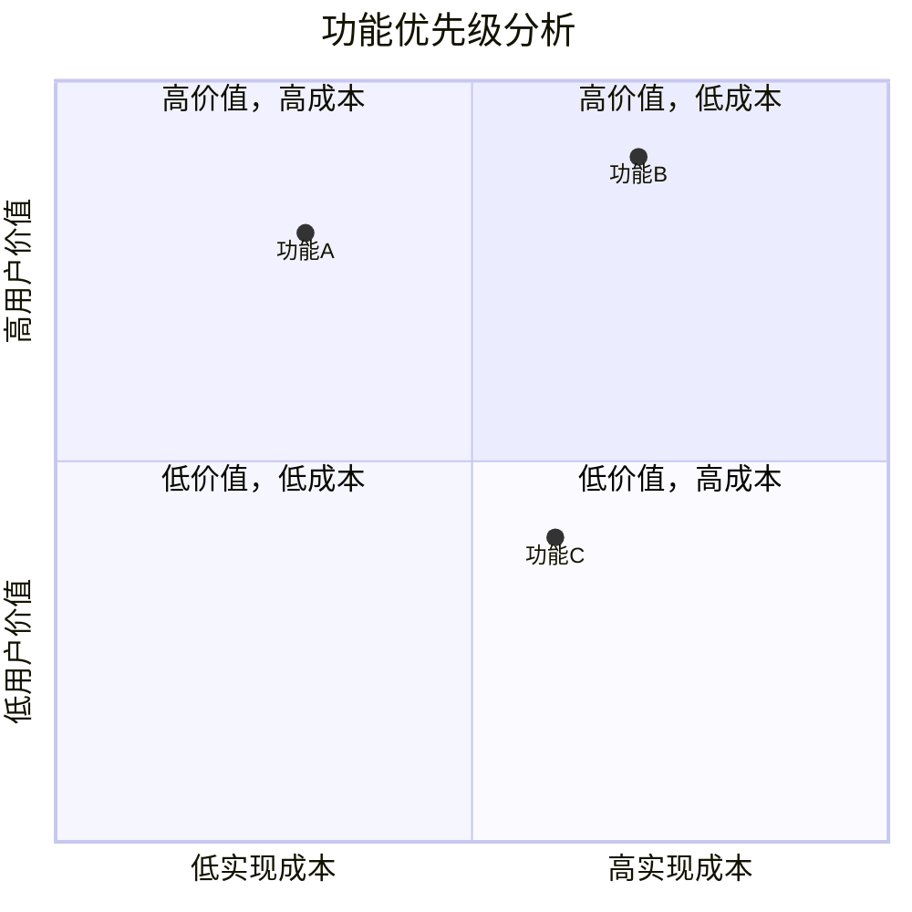
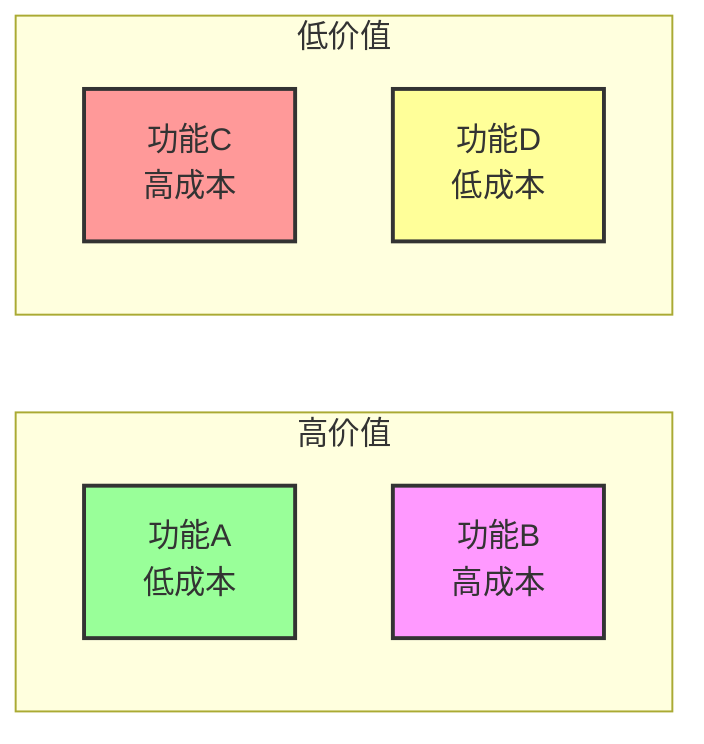
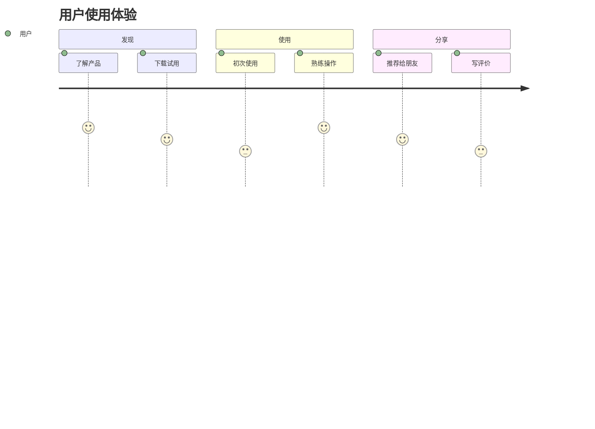
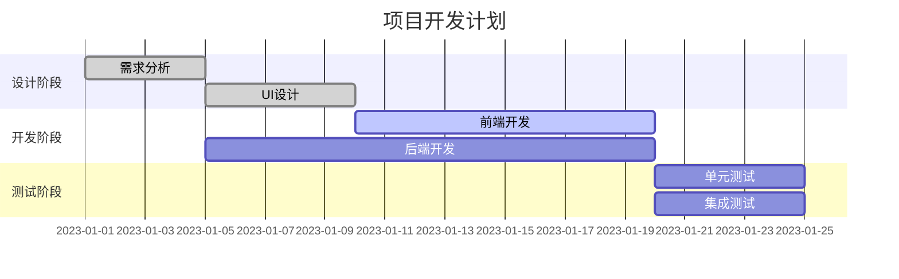
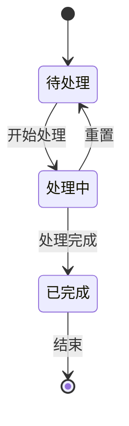

# Mermaid 高级图表测试

## 思维导图 (Mindmap) 测试

### 标准Mindmap语法


### 替代方案 - 流程图风格


## 象限图 (Quadrant Chart) 测试

### 标准QuadrantChart语法


### 替代方案 - 散点图风格


## 其他高级图表测试

### 用户旅程图


### 甘特图


### 状态图


## 故障排除

如果某些图表类型不显示，可能的原因：

1. **版本兼容性**：某些图表类型是较新添加的，可能需要更新Mermaid插件
2. **语法错误**：检查图表语法是否正确
3. **配置问题**：确保VS Code设置中启用了Mermaid支持

### 更新插件命令
```bash
code --update-extension bierner.markdown-mermaid
```

### 查看插件信息
```bash
code --show-versions bierner.markdown-mermaid
```

## 替代方案

如果某些图表类型仍然不显示，可以考虑：

1. 使用流程图模拟思维导图
2. 使用带样式的流程图模拟象限图
3. 使用在线Mermaid编辑器生成图片并嵌入到Markdown中
4. 使用其他图表库如PlantUML