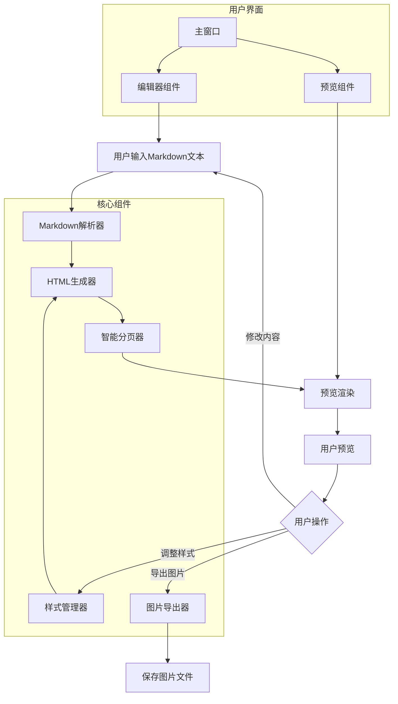
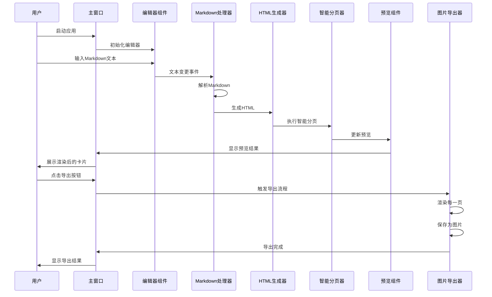
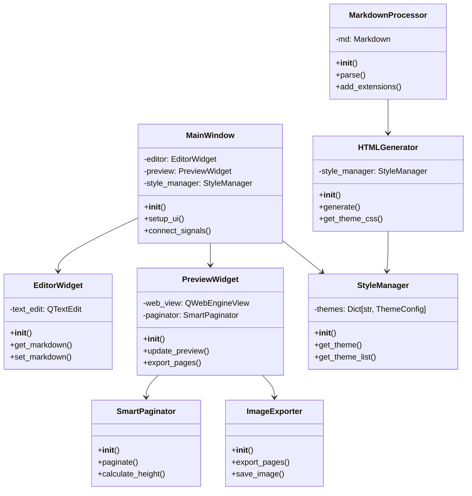
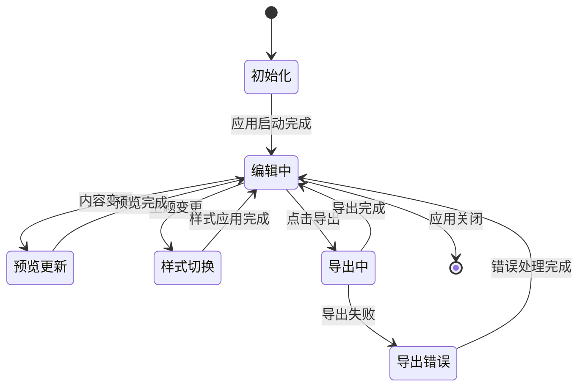
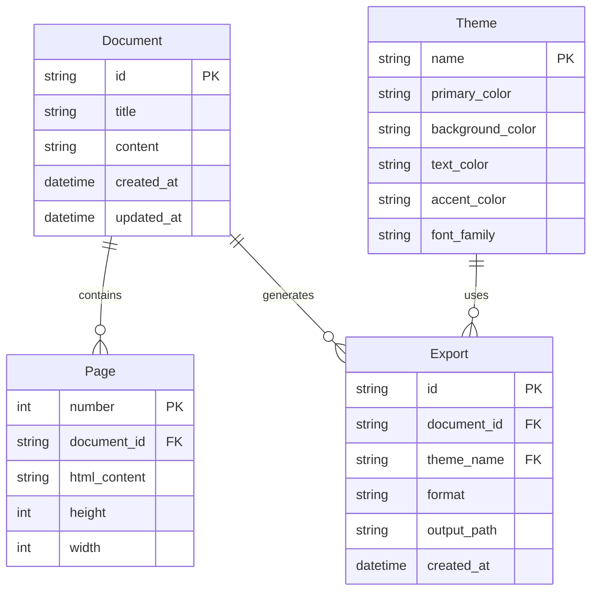
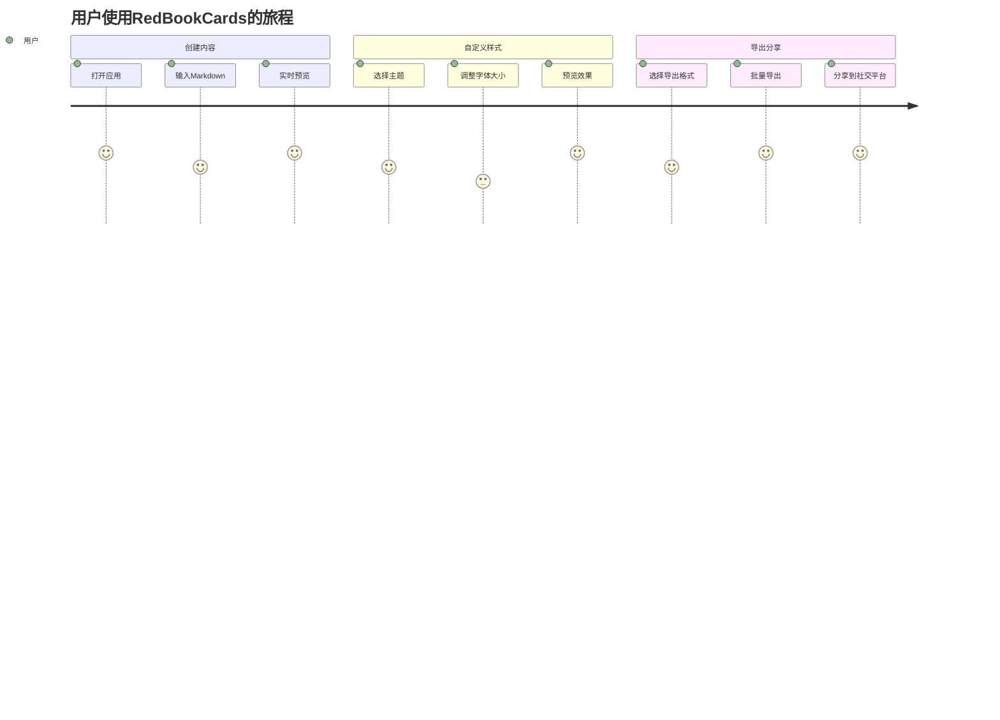
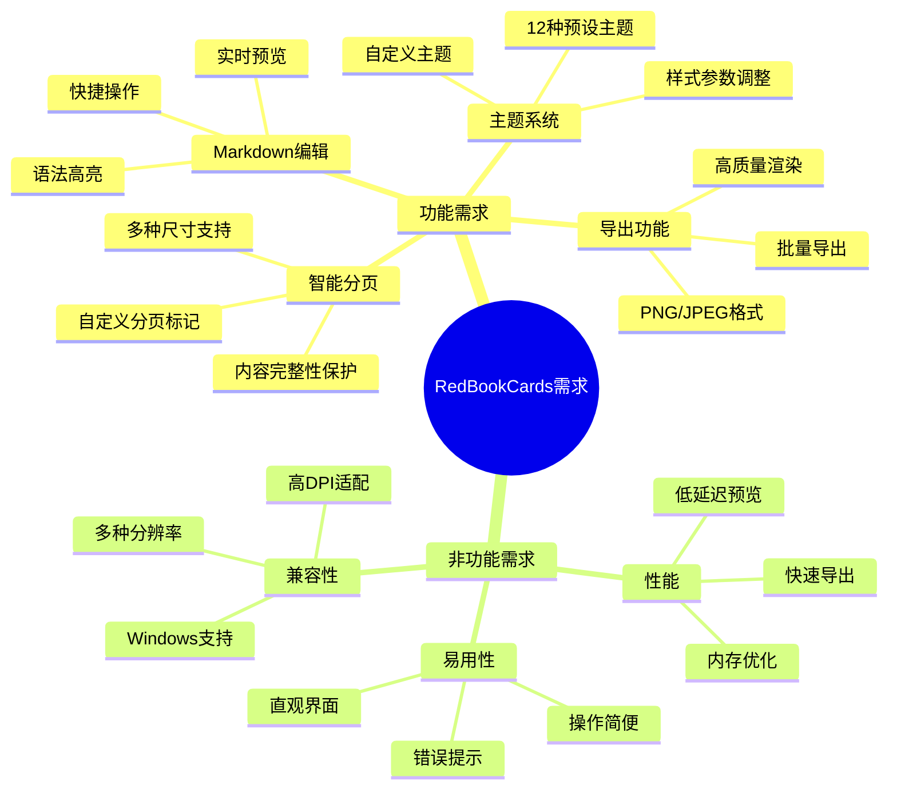
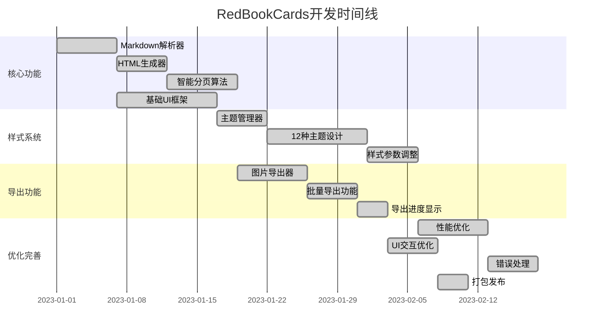
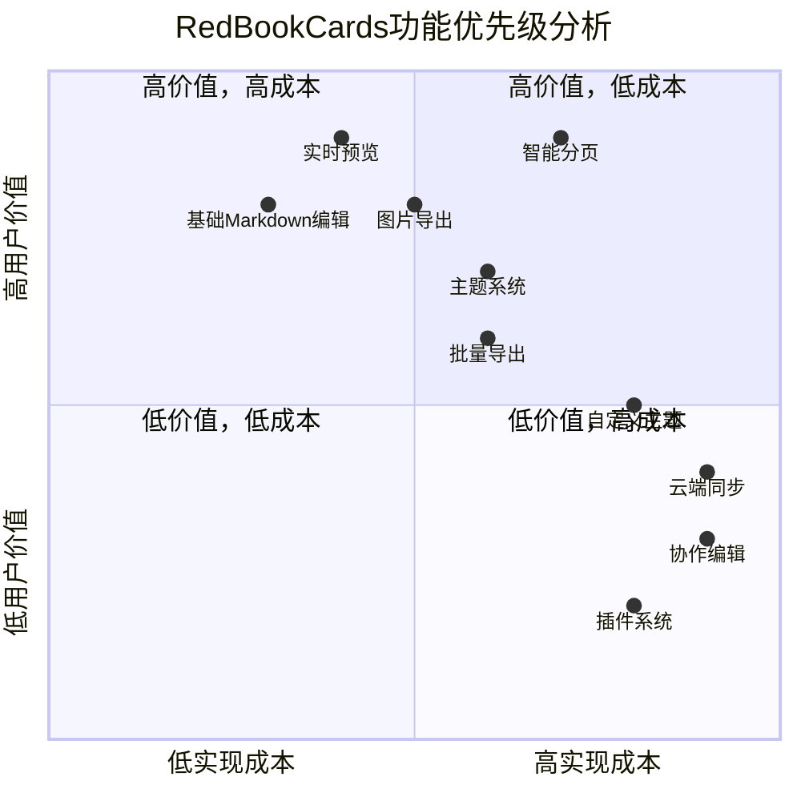

# RedBookCards 项目图表集合

## 1. 系统架构流程图

```mermaid
flowchart TD
    A[用户输入Markdown文本] --> B[Markdown解析器]
    B --> C[HTML生成器]
    C --> D[智能分页器]
    D --> E[预览渲染]
    E --> F[用户预览]
    F --> G{用户操作}
    G -->|修改内容| A
    G -->|调整样式| H[样式管理器]
    G -->|导出图片| I[图片导出器]
    H --> C
    I --> J[保存图片文件]
    
    subgraph "核心组件"
        B
        C
        D
        H
        I
    end
    
    subgraph "用户界面"
        K[编辑器组件]
        L[预览组件]
        M[主窗口]
    end
    
    K --> A
    L --> E
    M --> K
    M --> L
```

## 2. 系统时序图

```mermaid
sequenceDiagram
    participant U as 用户
    participant MW as 主窗口
    participant EW as 编辑器组件
    participant MP as Markdown处理器
    participant HG as HTML生成器
    participant SP as 智能分页器
    participant PW as 预览组件
    participant IE as 图片导出器
    
    U->>MW: 启动应用
    MW->>EW: 初始化编辑器
    U->>EW: 输入Markdown文本
    EW->>MP: 文本变更事件
    MP->>MP: 解析Markdown
    MP->>HG: 生成HTML
    HG->>SP: 执行智能分页
    SP->>PW: 更新预览
    PW->>MW: 显示预览结果
    MW->>U: 展示渲染后的卡片
    
    U->>MW: 点击导出按钮
    MW->>IE: 触发导出流程
    IE->>IE: 渲染每一页
    IE->>IE: 保存为图片
    IE->>MW: 导出完成
    MW->>U: 显示导出结果
```

## 3. 核心类图

```mermaid
classDiagram
    class MainWindow {
        -editor: EditorWidget
        -preview: PreviewWidget
        -style_manager: StyleManager
        +__init__()
        +setup_ui()
        +connect_signals()
    }
    
    class EditorWidget {
        -text_edit: QTextEdit
        +__init__()
        +get_markdown()
        +set_markdown()
    }
    
    class PreviewWidget {
        -web_view: QWebEngineView
        -paginator: SmartPaginator
        +__init__()
        +update_preview()
        +export_pages()
    }
    
    class MarkdownProcessor {
        -md: Markdown
        +__init__()
        +parse()
        +add_extensions()
    }
    
    class HTMLGenerator {
        -style_manager: StyleManager
        +__init__()
        +generate()
        +get_theme_css()
    }
    
    class SmartPaginator {
        +__init__()
        +paginate()
        +calculate_height()
    }
    
    class StyleManager {
        -themes: Dict[str, ThemeConfig]
        +__init__()
        +get_theme()
        +get_theme_list()
    }
    
    class ImageExporter {
        +__init__()
        +export_pages()
        +save_image()
    }
    
    MainWindow --> EditorWidget
    MainWindow --> PreviewWidget
    MainWindow --> StyleManager
    PreviewWidget --> SmartPaginator
    MarkdownProcessor --> HTMLGenerator
    HTMLGenerator --> StyleManager
    PreviewWidget --> ImageExporter
```

## 4. 应用状态机

```mermaid
stateDiagram-v2
    [*] --> 初始化
    初始化 --> 编辑中: 应用启动完成
    编辑中 --> 预览更新: 内容变更
    编辑中 --> 样式切换: 主题变更
    编辑中 --> 导出中: 点击导出
    预览更新 --> 编辑中: 预览完成
    样式切换 --> 编辑中: 样式应用完成
    导出中 --> 编辑中: 导出完成
    导出中 --> 导出错误: 导出失败
    导出错误 --> 编辑中: 错误处理完成
    编辑中 --> [*]: 应用关闭
```

## 5. 实体关系图

```mermaid
erDiagram
    Document {
        string id PK
        string title
        string content
        datetime created_at
        datetime updated_at
    }
    
    Theme {
        string name PK
        string primary_color
        string background_color
        string text_color
        string accent_color
        string font_family
    }
    
    Page {
        int number PK
        string document_id FK
        string html_content
        int height
        int width
    }
    
    Export {
        string id PK
        string document_id FK
        string theme_name FK
        string format
        string output_path
        datetime created_at
    }
    
    Document ||--o{ Page : contains
    Document ||--o{ Export : generates
    Theme ||--o{ Export : uses
```

## 6. 用户旅程图

```mermaid
journey
    title 用户使用RedBookCards的旅程
    section 创建内容
      打开应用: 5: 用户
      输入Markdown: 4: 用户
      实时预览: 5: 用户
    section 自定义样式
      选择主题: 4: 用户
      调整字体大小: 3: 用户
      预览效果: 5: 用户
    section 导出分享
      选择导出格式: 4: 用户
      批量导出: 5: 用户
      分享到社交平台: 5: 用户
```

## 7. 需求图

```mermaid
mindmap
  root((RedBookCards需求))
    功能需求
      Markdown编辑
        语法高亮
        实时预览
        快捷操作
      智能分页
        内容完整性保护
        多种尺寸支持
        自定义分页标记
      主题系统
        12种预设主题
        自定义主题
        样式参数调整
      导出功能
        PNG/JPEG格式
        批量导出
        高质量渲染
    非功能需求
      性能
        低延迟预览
        快速导出
        内存优化
      兼容性
        Windows支持
        高DPI适配
        多种分辨率
      易用性
        直观界面
        操作简便
        错误提示
```

## 8. 开发甘特图

```mermaid
gantt
    title RedBookCards开发时间线
    dateFormat  YYYY-MM-DD
    section 核心功能
    Markdown解析器     :done, des1, 2023-01-01, 2023-01-07
    HTML生成器        :done, des2, after des1, 5d
    智能分页算法      :done, des3, after des2, 7d
    基础UI框架       :done, des4, after des1, 10d
    
    section 样式系统
    主题管理器        :done, des5, after des4, 5d
    12种主题设计      :done, des6, after des5, 10d
    样式参数调整      :done, des7, after des6, 5d
    
    section 导出功能
    图片导出器        :done, des8, after des3, 7d
    批量导出功能      :done, des9, after des8, 5d
    导出进度显示      :done, des10, after des9, 3d
    
    section 优化完善
    性能优化         :done, des11, after des7, 7d
    UI交互优化       :done, des12, after des10, 5d
    错误处理         :done, des13, after des11, 5d
    打包发布         :done, des14, after des12, 3d
```

## 9. 功能象限图

```mermaid
quadrantChart
    title RedBookCards功能优先级分析
    x-axis 低实现成本 --> 高实现成本
    y-axis 低用户价值 --> 高用户价值
    quadrant-1 高价值，低成本
    quadrant-2 高价值，高成本
    quadrant-3 低价值，低成本
    quadrant-4 低价值，高成本
    
    基础Markdown编辑: [0.3, 0.8]
    实时预览: [0.4, 0.9]
    智能分页: [0.7, 0.9]
    主题系统: [0.6, 0.7]
    图片导出: [0.5, 0.8]
    批量导出: [0.6, 0.6]
    自定义主题: [0.8, 0.5]
    云端同步: [0.9, 0.4]
    协作编辑: [0.9, 0.3]
    插件系统: [0.8, 0.2]
```