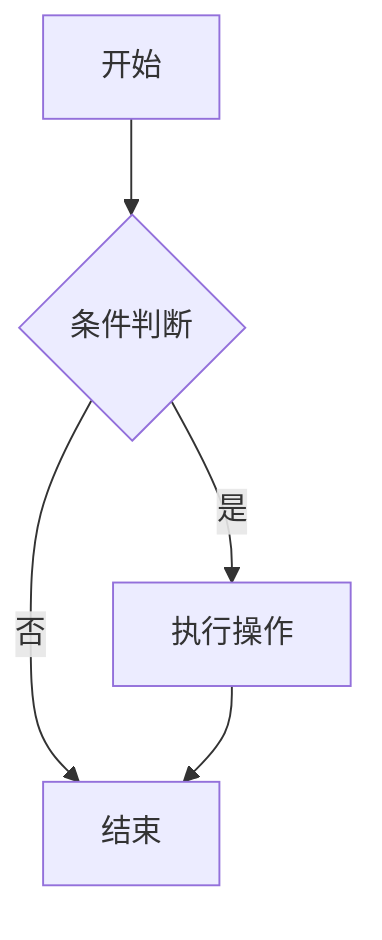
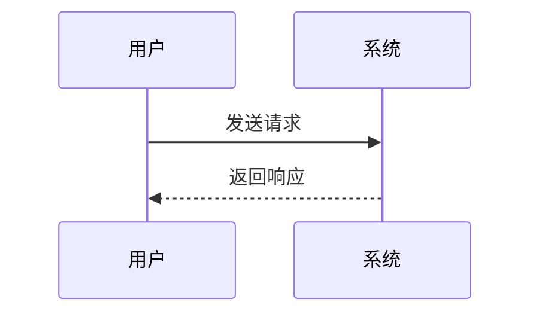
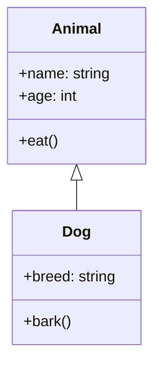

# Mermaid 测试

这是一个简单的Mermaid图表测试文件。

## 流程图测试

```mermaid
flowchart TD
    A[开始] --> B{条件判断}
    B -->|是| C[执行操作]
    B -->|否| D[结束]
    C --> D
```

## 时序图测试

```mermaid
sequenceDiagram
    participant A as 用户
    participant B as 系统
    A->>B: 发送请求
    B-->>A: 返回响应
```

## 类图测试

```mermaid
classDiagram
    class Animal {
        +name: string
        +age: int
        +eat()
    }
    
    class Dog {
        +breed: string
        +bark()
    }
    
    Animal <|-- Dog
```

如果您能看到这些图表正确渲染，说明Mermaid插件已成功安装并正常工作！